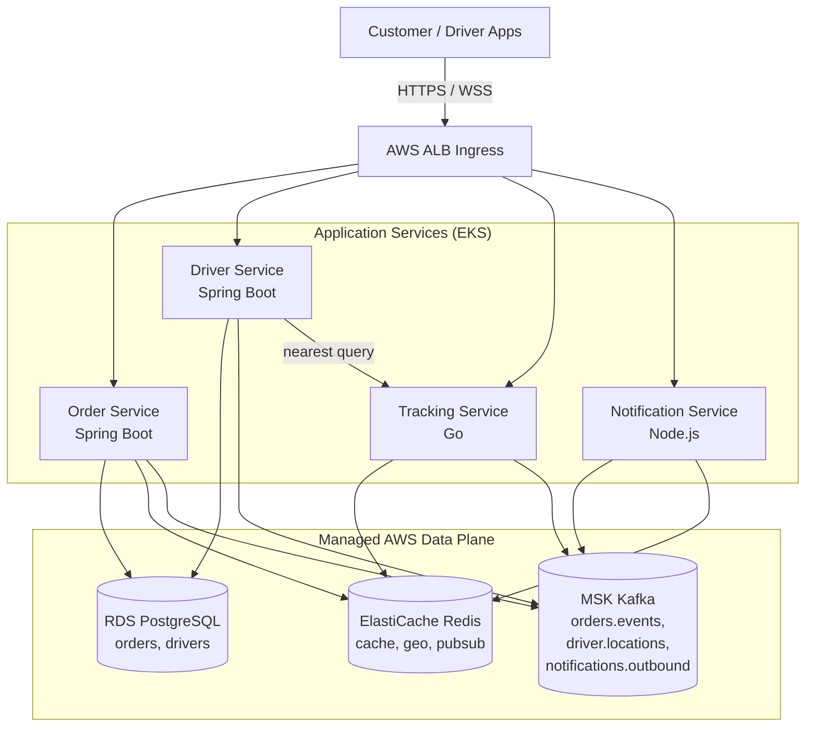
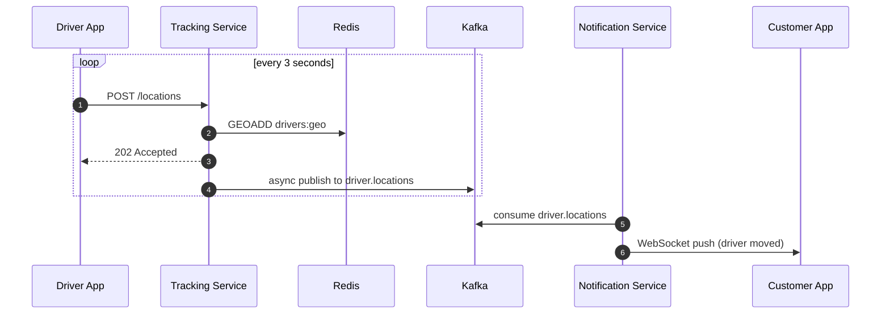

# Architecture

## Component diagram



## Order placement sequence

```mermaid
sequenceDiagram
    autonumber
    participant C as Customer App
    participant API as ALB Ingress
    participant O as Order Service
    participant DB as Postgres
    participant K as Kafka
    participant D as Driver Service
    participant T as Tracking Service
    participant N as Notification Service

    C->>API: POST /api/v1/orders
    API->>O: forward
    O->>DB: BEGIN; INSERT order; INSERT outbox; COMMIT
    O-->>C: 201 Created
    O->>K: relay outbox -> orders.events (OrderCreated)
    D->>K: consume OrderCreated
    D->>T: GET /drivers/nearest?lat&lon
    T-->>D: candidates from Redis GEO
    D->>DB: assign + emit DriverAssigned
    D->>K: orders.events (DriverAssigned)
    N->>K: consume both events
    N->>C: WebSocket push
```

## Driver telemetry path



## Why the transactional outbox?

The naive way to publish an `OrderCreated` event is to write the order to Postgres, then call `kafka.send()`. This is broken: if the process crashes between the two calls, the order exists but no event was published, and downstream services have no idea it happened.

The transactional outbox solves this by writing the event row to Postgres in the same transaction as the order. A separate relay process drains unpublished outbox rows to Kafka and marks them published. The relay is idempotent, runs on every replica, and uses `FOR UPDATE SKIP LOCKED` so two relayers never publish the same event twice. Worst case on a crash: an event is published but not marked published, so it's published again — downstream consumers must already be idempotent on `event-id`, which they are.

## Why Redis Pub/Sub for the notification path?

A single customer's WebSocket lives on exactly one `notification-service` pod, but the Kafka consumer group will hand any given partition to any pod. Without coordination, the pod that consumed the event might not be the pod holding the relevant socket. Redis Pub/Sub broadcasts each event to every replica, and each replica checks its local subscription table. It's cheap (events are small JSON, throughput is bounded by user count, not driver count) and avoids tying WebSocket placement to Kafka partition assignment.

## Scaling characteristics

| Workload                          | Bottleneck                                   | Mitigation                                              |
|-----------------------------------|----------------------------------------------|---------------------------------------------------------|
| Order creation                    | Postgres write throughput                    | Connection pooling, partition by region in v2           |
| Driver pings (high write rate)    | Kafka producer throughput per pod            | HPA scales `tracking-service`; bounded buffer + drop-old |
| Nearest-driver query              | Redis CPU on geo-search                      | Shard `drivers:geo:{cityKey}` keys by region            |
| WebSocket connections             | File descriptors per pod, memory             | HPA on `notification-service`, sticky ClientIP affinity |
| Outbox relay                      | Postgres lock contention                     | SKIP LOCKED + batched relay every 500ms                 |
